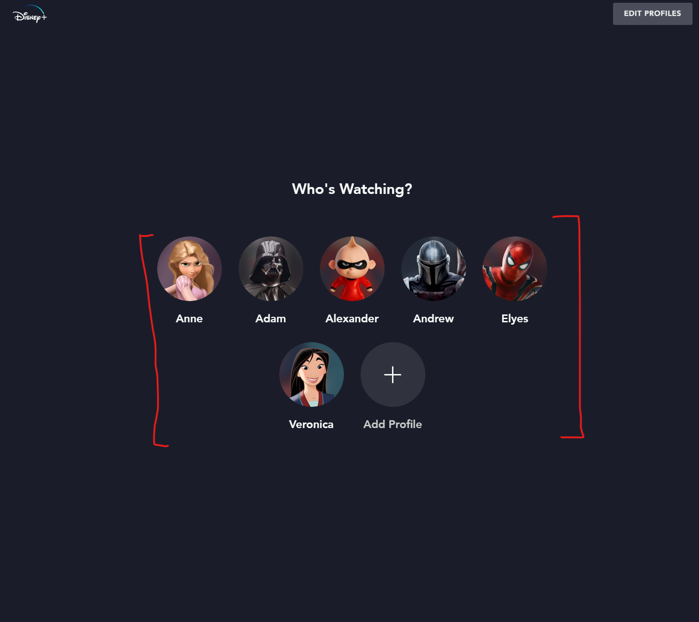

# style-extractor

The purpose of this script is to take simplify duplicating components in webpages.



## How to use
1. Clone the repo
1. npm install
1. install typescript if you don't have it.
1. ```
   > tsc
    ```
1. Copy the compiled output to the browser's debugger.
1. Run the following in the brower's console.
        ```
        
        let css_selector = 'selector for an element';
        // Produces output for react
        style_extractor({selector: css_selector, reactMode: true})
        // Produces output for inline stylesheets
        style_extractor({selector: css_selector})
        ```
1. Wait for the output


## Or Just copy paste and execute the command above.


```
"use strict";
function style_extractor(selector, reactMode, textWrapper) {
    textWrapper = textWrapper || (function (x) {
        return "{TitleService(`".concat(x, "`)}");
    });
    function getAllStyles(elem) {
        if (!elem)
            return {}; // Element does not exist, empty list.
        var win = document.defaultView || window, style, styleNode = {};
        try {
            if (win.getComputedStyle) { /* Modern browsers */
                style = win.getComputedStyle(elem, '');
                for (var i = 0; i < style.length; i++) {
                    styleNode[style[i]] = style.getPropertyValue(style[i]);
                    //               ^name ^           ^ value ^
                }
            }
            else if (elem.currentStyle) { /* IE */
                style = elem.currentStyle;
                for (var name in style) {
                    styleNode[name] = style[name];
                }
            }
            else { /* Ancient browser..*/
                style = elem.style;
                for (var i = 0; i < style.length; i++) {
                    styleNode[style[i]] = style[style[i]];
                }
            }
        }
        catch (e) {
            console.error(e);
        }
        return styleNode;
    }
    var getDefaultProperty = function (tagName, property) {
        // Create new element
        var ele = document.createElement(tagName);
        // Append to the body
        document.body.appendChild(ele);
        // Get the styles of new element
        var styles = window.getComputedStyle(ele);
        // Get the value of property
        var value = styles.getPropertyValue(property);
        // Remove the element
        document.body.removeChild(ele);
        // Return the value of property
        return value;
    };
    var snakeToCamel = function (str) {
        return str.toLowerCase().replace(/([-_][a-z])/g, function (group) {
            return group
                .toUpperCase()
                .replace('-', '')
                .replace('_', '');
        });
    };
    var root = document.querySelector(selector);
    function buildStylesForElement(root) {
        if (root) {
            var elementStyles = getAllStyles(root);
            var non_default_styles = {};
            for (var key_1 in elementStyles) {
                var defaultValue = getDefaultProperty(root === null || root === void 0 ? void 0 : root.tagName, key_1);
                if (defaultValue !== elementStyles[key_1]) {
                    non_default_styles[key_1] = elementStyles[key_1];
                }
            }
            if (reactMode) {
                var reactStyle = {};
                for (var key in non_default_styles) {
                    reactStyle[snakeToCamel(key)] = non_default_styles[key];
                }
                return reactStyle;
            }
            return non_default_styles;
        }
    }
    var style_dic = {};
    var class_count = 0;
    function crawlElement(el, styleFunction) {
        var style = styleFunction(el);
        var _key = JSON.stringify(style);
        var current_class;
        if (!Object.values(style_dic).find(function (v) {
            return v.key === _key;
        })) {
            console.log('add class');
            style_dic[class_count] = {
                key: JSON.stringify(style),
                style: style,
                class_count: class_count
            };
            current_class = "class".concat(class_count);
            class_count++;
        }
        else {
            var class_count_1 = Object.values(style_dic).find(function (v) {
                return v.key === _key;
            }).class_count;
            current_class = "class".concat(class_count_1);
        }
        var childEls = [];
        var children = (el === null || el === void 0 ? void 0 : el.childNodes) || [];
        for (var i_1 = 0; i_1 < children.length; i_1++) {
            switch (children[i_1].nodeType) {
                case 3:
                    if (children[i_1].nodeValue) {
                        childEls.push(textWrapper(children[i_1].nodeValue));
                    }
                    break;
                default:
                    childEls.push(crawlElement(children[i_1], styleFunction));
                    break;
            }
        }
        var attributes = '';
        for (var i = 0; i < el.attributes.length; i++) {
            var attr = el.attributes[i];
            if (['class', 'style'].indexOf(attr.name) === -1) {
                var name_1 = attr.name;
                switch (name_1) {
                    case 'tabindex':
                        name_1 = 'tabIndex';
                        break;
                }
                attributes += "".concat(name_1, "={`").concat(attr.value, "`} ");
            }
        }
        return "<".concat(el === null || el === void 0 ? void 0 : el.localName, " ").concat(attributes, " ").concat(style ? "style=" : '').concat(style && reactMode ? "{".concat(current_class, "}") : "".concat(Object.keys(style).map(function (v) { return v + ':' + style[v]; }).join(';')), ">\n        ").concat(childEls.join("\n        "), "\n        </").concat(el === null || el === void 0 ? void 0 : el.localName, ">");
    }
    function buildStyleLib(dic) {
        var commonvalues = [];
        var color_count = 0;
        Object.values(dic).map(function (v) {
            var style_ = v.style;
            var _loop_1 = function (i) {
                var val = "".concat(style_[i]);
                var color_name = void 0;
                if (val.startsWith('rgb') || val.startsWith('#')) {
                    if (!commonvalues.find(function (v) { return v.value === val; })) {
                        color_name = "color_".concat(color_count++);
                        commonvalues.push({
                            value: val,
                            name: color_name
                        });
                    }
                    else {
                        var name_2 = commonvalues.find(function (v) { return v.value === val; }).name;
                        color_name = name_2;
                    }
                    style_[i] = "###".concat(color_name, "###");
                }
            };
            for (var i in style_) {
                _loop_1(i);
            }
        });
        return commonvalues;
    }
    function getColors(str) {
        //const regex = new RegExp(`#\\\#\\\#\\\#(?<name>[a-zA-Z0-9_]*)\\\#\\\#\\\##`, 'gm')
        var regex = /\#\#\#(?<name>[a-zA-Z0-9_]*)\#\#\#/gm;
        // const str = `"###color_3###"`;
        var m;
        var results = [];
        while ((m = regex.exec(str)) !== null) {
            // The result can be accessed through the `m`-variable.
            m.forEach(function (match, groupIndex) {
                console.log("Found match, group ".concat(groupIndex, ": ").concat(match));
                if (results.indexOf(match) === -1) {
                    results.push(match);
                }
            });
        }
        return results;
    }
    var result_el = crawlElement(root, buildStylesForElement);
    var class_defs = "";
    var style_lib = buildStyleLib(style_dic);
    Object.values(style_dic).map(function (v) {
        var style_ = v.style;
        class_defs += "\n        let class".concat(v.class_count, " = ").concat(JSON.stringify(style_, null, 4), ";\n        ");
    });
    var colors = getColors(class_defs);
    var style_defs = '';
    style_lib.map(function (v) {
        style_defs += "\n        let ".concat(v.name, " = `").concat(v.value, "`;\n        ");
    });
    colors.map(function (v) {
        var lasttime = class_defs;
        do {
            lasttime = class_defs;
            class_defs = class_defs.replace("\"###".concat(v, "###\""), v);
        } while (lasttime !== class_defs);
    });
    console.log("\n    ".concat(style_defs, "\n    ").concat(class_defs, "\n    return (\n        ").concat(result_el, "\n    )"));
}
//# sourceMappingURL=index.js.map
```